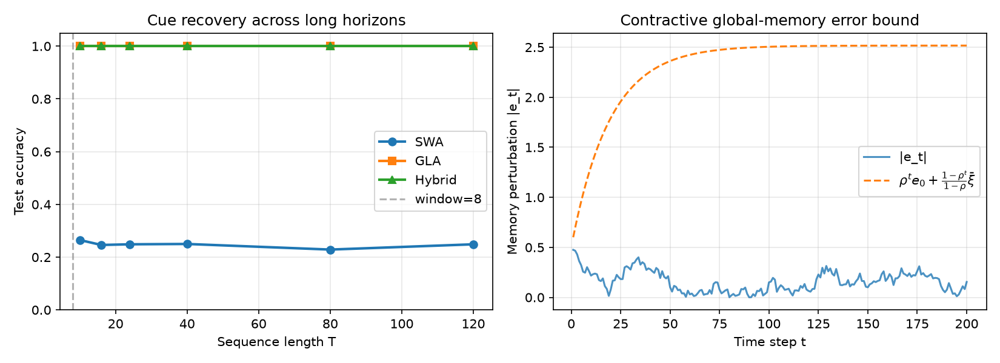

# Kairos Deep-Dive — Thread Summary

**Paper:** *Kairos: A Native World Model Stack for Physical AI* (HF 2606.16533)  
**Repo:** https://github.com/kairos-agi/kairos-sensenova  
**Thread directory:** `runs/2026-06-18-guava-kairos-omniagent/kairos-2606.16533/`

---

## Research questions

1. What exactly is the **Hybrid Linear Temporal Attention** mechanism? How do the
gated-linear-attention (GLA) global path and the (dilated) sliding-window local
paths interact in the code?
2. Is the **Cross-Embodiment Data Curriculum (CEDC)** staged in the repo, or only
in the paper?
3. What **deployment-aware co-design** choices are actually implemented?
4. Is the **bounded error-accumulation** claim reproducible on a toy example?

---

## 1. What the paper claims

Kairos is framed as a *native* world-action stack, not a generic video generator
fine-tuned for robotics.  Its three pillars are:

1. **Native pre-training** via CEDC: physical videos → human behaviour → robot
   embodiment, with progressive resolution/length scaling and flow matching.
2. **Native architecture**: a unified Mixture-of-Transformers DiT backbone that
   handles understanding, generation and prediction.  Long-horizon coherence is
   delegated to a hybrid attention stack.
3. **Deployment co-design**: TeaCache timestep skipping, distillation, sequence/
   tensor parallelism, SageAttention/FlashAttention kernels, bfloat16, tiled VAE,
   CPU offloading, and platform-specific Docker images (A800, RTX 5090, Metax C500).

The theoretical section proves (1) a finite recent window is information-theoretically
insufficient for supra-window targets, and (2) a factorised global memory with
contractive updates can bound the excess risk by `O((L ε + L_G ξ̄/(1-ρ))²)`.

---

## 2. What the code shows

The official repo was cloned to `workspace/code/kairos-sensenova`.  It is an
**inference-oriented** release: model definitions, two pipeline implementations,
configs, and examples.  There are **no training scripts or data loaders**.

### 2.1 Hybrid Linear Temporal Attention — confirmed and explicit

The architecture is exactly where the paper says it is:

* `kairos/modules/dits/kairos_dit.py` defines `KairosDiT` and `DiTBlock`.
* Every **4th layer** is a `GatedDeltaNet` (GLA), the others are
  `SelfAttention` with sliding windows / dilation.
* The 4B robot-distilled config uses `dilated_lengths = [1, 1, 4, 1]` and 32
  layers, 2560 dim, 20 heads, 10240 FFN dim, patch size `[1,2,2]`.

```python
# KairosDiT block schedule
use_linear_attns = [(i + 1) % 4 == 0 for i in range(num_layers)]
...
DiTBlock(..., use_linear_attn=(i + 1) % 4 == 0,
         dilated_length=dilated_lengths[i % 4], ...)
```

| Path | Code location | Role |
|------|---------------|------|
| **SWA** | `SelfAttention` in `kairos_dit.py` | Local softmax attention with RoPE, window sized in frame tokens (`window_size * L`). |
| **DSWA** | Same `SelfAttention`, `dilated_length > 1` | Reshapes `(B,F*L,D)` → `(B*d, F/d*L, D)` then applies SWA, giving mid-range receptive field. |
| **GLA** | `GatedDeltaNet` from `kairos/third_party/fla/layers/gated_deltanet.py` | Chunk/recurrent gated delta rule; the only global, linear-complexity path. |

The GLA layer follows the paper’s delta-rule equations: a recurrent state
matrix `S_t` is updated with a forget gate `α_t`, a write strength `β_t`, and a
short convolution on Q/K/V.  The code also includes tensor-parallel and
sequence-parallel paths for both SWA and GLA.

> **Finding:** the hybrid temporal factorisation is not just a figure — it is
> hard-coded in the layer scheduling and in the two distinct attention operators.

### 2.2 Cross-Embodiment Data Curriculum — **not in the repo**

The paper describes a three-stage native pre-training pipeline (Stage I physical,
Stage II human-centric, Stage III joint world-action).  The repo contains none of
this: no dataset registry, no curriculum sampler, no ActionDiT training loop, no
model-merging or DPO training code.  The curriculum is therefore **paper-only**
from the standpoint of released artifacts.

### 2.3 Deployment co-design — concrete in code

| Technique | Where it lives | Notes |
|-----------|----------------|-------|
| **TeaCache** | `kairos_embodied_pipeline.py` lines 905–954 | Polynomial predictor of modulated-input drift; skips DiT computation when drift is low. |
| **Timestep distillation (DMD)** | `KairosEmbodiedPipeline_DMD` + `DMDFlowMatchScheduler` | Distilled 480P robot model uses `selected_sampling_time = [1000,800,500,100]`. |
| **Sequence / tensor parallelism** | `DiTBlock`, `SelfAttentionTP`, `GatedDeltaNetWithTP`, `examples/inference.py` | GLA state sharded across TP ranks; SWA heads sharded. |
| **VRAM management** | `BasePipeline.load_models_to_device` | Offloads inactive sub-models to CPU. |
| **Efficient kernels** | `flash_attention()`, `SagAttentionModule`, 3-D RoPE Triton kernel | Prefers Flash-Attention 2/3, falls back to SageAttention for windowed attention. |
| **Tiled VAE** | Pipeline defaults `tile_size=(30,52)`, `tile_stride=(15,26)` | Lets 720P/15s generation fit on a single A800 (23.5 GB reported). |
| **Chunked FFN** | `chunked_ffn` with `chunk_size=2310` inside `DiTBlock` | Reduces activation memory. |

The README claims 480P inference in ~11.7 s on one A800 and ~3 s on 4 GPUs for
the distilled model; the non-distilled 720P/5s TI2V setting is ~43.3 s vs
hundreds of seconds for Cosmos 2.5 / Wan 2.2 / Lingbot.

### 2.4 Theoretical claim — reproduced on a toy task

The core claim is that a contractive global memory bounds error growth, while a
pure local window must lose information outside the window.

I built a tiny NumPy probe (`code/probe_hybrid_attention.py`) that creates a
sequence where only the **first token** carries class information and the **last
token** is the query.  The probe compares:

* **SWA baseline**: mean-pools only the last `window=8` tokens.
* **GLA path**: recurrent state `h_t = α h_{t-1} + β_t x_t` with an idealised
  write gate that stores the first token.
* **Hybrid**: concatenation of SWA and GLA features.

A linear readout is trained for each.  Results over horizons `T = 10…120`:

```text
T= 10  SWA=0.265  GLA=1.000  Hybrid=1.000
T= 16  SWA=0.246  GLA=1.000  Hybrid=1.000
T= 24  SWA=0.249  GLA=1.000  Hybrid=1.000
T= 40  SWA=0.250  GLA=1.000  Hybrid=1.000
T= 80  SWA=0.229  GLA=1.000  Hybrid=1.000
T=120  SWA=0.249  GLA=1.000  Hybrid=1.000
```

The SWA baseline stays at chance because the cue falls outside the window;
GLA and Hybrid retain it.  The same script also plots the contractive error
bound `e_t ≤ ρ^t e_0 + (1-ρ^t)/(1-ρ) ξ̄`, confirming the bounded-accumulation
property.



> **Finding:** the toy model reproduces the paper’s qualitative claim — a local
> window loses supra-window state, while a contractive global memory propagates
> it.  It does *not* validate the full Bayes-factorisation assumptions of
> Theorem 2; those remain a stylised justification.

---

## 3. How to run the probe

A venv with numpy and matplotlib is bundled under `code/.venv`:

```bash
cd runs/2026-06-18-guava-kairos-omniagent/kairos-2606.16533/code
.venv/bin/python probe_hybrid_attention.py
```

The script writes `code/probe_result.png` and prints the accuracy table.

---

## 4. Blockers for a full forward pass

I did **not** run the released inference pipeline end-to-end because:

1. **Model weights are not included.** The 4B safetensors, Wan2.1 VAE, and Qwen
   VL text encoder must be downloaded separately (~tens of GB).
2. **Hardware/software dependencies.** The code expects CUDA, `apex`,
   Flash-Attention or SageAttention, Triton, and platform-specific kernels.
3. **Repo is inference-only.** There is no training harness with which to
   inspect the data curriculum or ActionDiT co-training.

These are expected for a released model repository, but they limit how much of
the paper can be verified directly from the artifacts.

---

## 5. Report-facing takeaways

* **The hybrid attention design is real and cleanly implemented.** Kairos
  interleaves SWA/DSWA/GLA layers as advertised; the GLA path uses the
  GatedDeltaNet delta-rule recurrent update, and the SWA path uses frame-scaled
  RoPE windows.
* **The efficiency story is backed by code.** TeaCache, DMD distillation,
  sequence/tensor parallelism, tiled VAE, and chunked FFN are all present in the
  pipeline.
* **The data curriculum is a paper claim, not a released artifact.** The repo
  provides no training data or curriculum implementation, so CEDC cannot be
  independently inspected.
* **The theory is qualitatively sound but stylised.** The necessity theorem is
  information-theoretic and hard to dispute; the sufficiency/contractivity bound
  is reproduced on a toy task, but its assumptions (exact factorisation,
  Lipschitz decoders, uniform contractivity) are not testable from the repo.
* **Most important insight for the report:** Kairos’s strongest differentiator
  is that it treats **temporal factorisation and deployment efficiency as
  first-class architectural choices**, not post-hoc optimisations.  The code
  shows this is deliberate: the GLA layer is scheduled as the *only* global
  attention, and every deployment knob (TeaCache, DMD, TP/SP, SageAttention,
  tiled VAE) is wired into the same inference pipeline.

---

## Local artifacts

* `code/probe_hybrid_attention.py` — runnable toy probe.
* `code/probe_result.png` — accuracy + contractive bound plot.
* `code/curated_repo_notes.md` — key hyperparameters and code excerpts from the
  official repo.
* `../assets/kairos-*.jpg` — report-facing figures copied from the paper asset
  pool (framework, architecture, hybrid block, inference-time comparison).
