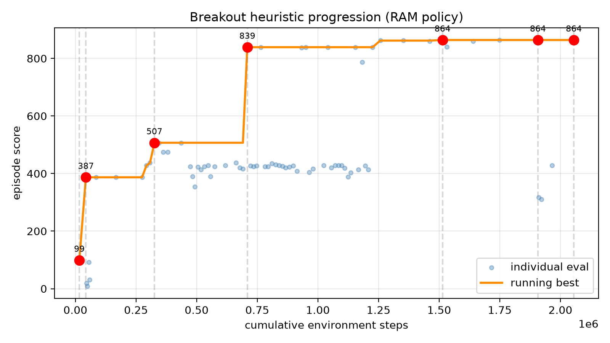
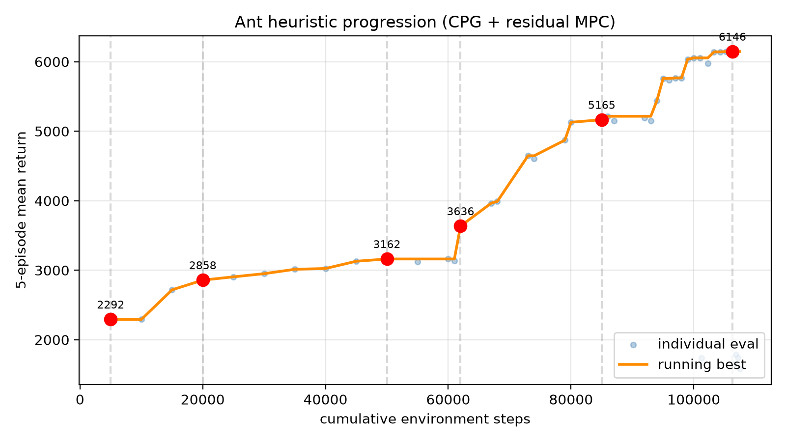
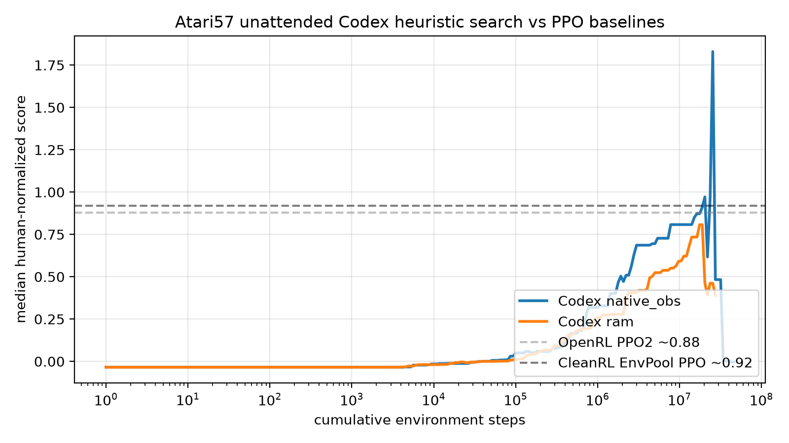

# Deep Dive: Learning Beyond Gradients / Heuristic Learning

**Thread:** `learning-beyond-gradients`  
**Run:** `2026-06-25-robotwin-foresight-beyond-gradients`  
**Source:** Jiayi Weng, *Learning Beyond Gradients* (May 2026) — [blog](https://trinkle23897.github.io/learning-beyond-gradients/), [artifact repo](https://github.com/Trinkle23897/learning-beyond-gradients)  
**Research question:** Is “Heuristic Learning” a genuine paradigm shift beyond gradient-based learning, or a reframing of coding-agent-assisted engineering? What does the artifact repo actually demonstrate?

---

## 1. What is being claimed?

Weng’s central observation is that, as coding agents (here `gpt-5.4` / Codex) become better at reading failures, editing code, adding tests, and watching replays, a *program system* can improve without training a new network or updating weights. He calls this process **Heuristic Learning (HL)** and the maintained artifact **Heuristic System (HS)**.

In his own terms:

- HL is built out of program code.
- It has the same state → action → feedback → update loop as Deep RL, but the object being updated is **software structure**, not neural-network parameters.
- Feedback can be reward, test cases, logs, videos, replays, or human feedback.
- Updates are direct code edits by a coding agent, not backpropagation.
- An HS is **more than a `policy.py`**: it contains the programmatic policy, state representation/detectors, feedback channels, experiment records (`trials.jsonl`, `summary.csv`), replays/tests, memory, and the update mechanism.

### HL vs Deep RL

| Axis | Deep RL | Heuristic Learning |
| --- | --- | --- |
| Policy | Neural-network parameters | Code: rules, state machines, controllers, MPC, macro-actions |
| State | Usually explicit observations | Explicit variables, detectors, caches, readable representations |
| Action | NN forward pass | Executing code logic |
| Feedback | Mostly fixed reward | Coding-agent context: tests, env feedback, logs, replays |
| Update | Gradient-based parameter update | Direct code edits by a coding agent |
| Memory | Replay buffer (off-policy) / none (on-policy) | Trials, summaries, failure reasons, replays, version diffs |

### Core empirical claims

1. **Atari Breakout:** a RAM heuristic went `387 → 507 → 839 → 864` (theoretical max).
2. **MuJoCo Ant:** a pure-Python rhythmic gait + short-horizon residual MPC reached `6000+` return, comparable to common Deep RL results.
3. **MuJoCo HalfCheetah:** interpretable gait/posture rules + staged-tree MPC reached a 5-episode mean of `11836.7`.
4. **VizDoom D3 Battle:** cv2/NumPy screen CV without NN training reached `mean=557.0 / min=440.0` over 10 seeds.
5. **Atari57 unattended batch:** `57 games × 2 obs modes × 3 repeats = 342` coding-agent trajectories. Median human-normalized score (HNS) around 1M env steps was already above PPO-style baselines at the same step count.
6. **Conceptual claim:** This is a candidate for the next paradigm after pretraining, RLHF, and large-scale RL/RLVR — at least for anything that can be verified and iterated on.

---

## 2. What do the policies actually look like?

The repo is unusually concrete: every policy is plain Python, with append-only `trials.jsonl` and regenerated `summary.csv`. I inspected the main representatives.

| Policy | Lines (total / code) | Functions / classes | Key techniques |
| --- | ---: | ---: | --- |
| Breakout | 1088 / 957 | 37 / 8 | RAM affine decoders, RGB connected-component segmentation, ball-velocity estimation, wall reflection, stuck-loop breaker, fast-low-ball lead, late-game taper |
| Ant | 1160 / 1062 | 27 / 4 | CPG phase oscillator, stance/swing warping, PD tracking, yaw/roll/pitch feedback, foot contact, **residual MPC** (H=10, C=96) inside a copied MuJoCo model |
| HalfCheetah | 977 / 854 | 31 / 2 | Fourier target-angle PD gait, asymmetric phase frequency, **one-action / two-step tree MPC overlay** with bang-bang candidates, staged swing-amplitude schedule |
| VizDoom D3 | 1098 / 1015 | 21 / 1 | cv2 color thresholds, morphological close/dilate, connected components, enemy/item/threat/projectile/nav detectors, finite-state “bounce / telegraph / combat / item” machine |
| Montezuma 400 | 603 / 573 | 8 / 1 | Open-loop replay of 86 macro-actions extracted from an unattended Codex run |

A few take-aways from reading the code:

- These are **not** “a few if-statements.” They are engineered control systems: PD controllers, model-predictive rollouts, computer-vision pipelines, and state machines.
- The policies are **auditable** and **modular** (detectors → policy → logging). This modularity is what makes the coding-agent loop feasible.
- The most powerful ingredient is **not** the LLM writing code from scratch; it is the LLM iterating on a human-interpretable scaffold (CPG, geometry controller, CV pipeline) and using cheap simulation rollouts as feedback.

### Breakout: from geometry to loop-breaking

The policy first decodes ball/paddle coordinates from RAM (`ram[99]`, `ram[101]`, `ram[72]`) or from RGB connected components, estimates velocity, reflects against side walls, and moves the paddle to the predicted intercept. The hard part is the **stuck loop**: the ball can enter a periodic route that clears no new bricks. The fix is a perturbation offset that cycles every 256 steps when no reward has occurred, plus a fast-low-ball lead and a late-game taper that releases the offset as the ball approaches the paddle.

### Ant: CPG + residual MPC

The Ant policy is the clearest example of HL as *systems engineering*. It starts with a rhythmic CPG (left/right anti-phase oscillators), adds harmonics and posture feedback, then wraps a short-horizon MPC around it: at each step it samples residual action sequences in a copied MuJoCo state, scores them, executes the first residual, and warm-starts the next plan. The final system has 59 scalar config fields and reaches ~6k return.

### VizDoom D3: a CV state machine

The D3 policy is a first-person shooter smoke policy: detect enemies by red-channel thresholds, medkits/ammo by brightness, threats/projectiles by color masks, and navigate by finding dark “openings” in the lower screen band. A `State` object tracks health, ammo, damage, panic, boredom, and wall-escape, and switches between combat, item-seeking, bounce-turn exploration, and telegraph navigation. It is an explicit rule system, not a learned controller.

---

## 3. Verifying the score progressions

I parsed the repo’s `summary.csv` files and reran the Breakout reproduction commands. The claimed progressions are real and reproducible.

### Breakout `387 → 507 → 839 → 864`

From `heuristic_breakout_trials_summary.csv` (RAM policy):

| Trial | Score | Cumulative env steps | Mechanism |
| --- | ---: | ---: | --- |
| `baseline_v0` | 99 | 16,303 | Initial RAM intercept |
| `tunnel0_v1` | 387 | 43,303 | Return the ball, no loop breaker |
| `stuck12_t1024_s256_v1` | 507 | 325,859 | Stuck-loop perturbation |
| `fastlead3_v1` | 839 | 708,968 | Fast low-ball lead |
| `secondwall_stucktaper8_lag2_v1` | 864 | 1,513,928 | Late-game taper + paddle-lag compensation |
| `breakout_default_864_eval3_v1` | 864 | 1,907,240 | 3-episode validation of final config |
| `breakout_vision_min0_h8_eval3_v1` | 864 | 2,055,402 | Pure RGB vision controller (structure transferred from RAM) |

**Reproduction probe (this thread):** Running the blog’s exact CLI flags reproduced 387, 507, 839, and 864 exactly on `envpool==1.2.5`. See `code/reproduction_log.md` for full commands and outputs.

### Ant up to 6000+

From `heuristic_ant_trials_summary.csv`:

| Trial | Mean return | Cumulative env steps | Mechanism |
| --- | ---: | ---: | --- |
| `ant_lr_cpgpd_v1` | 2,291.9 | 5,000 | Left/right anti-phase CPG + PD |
| `ant_yawaxis_grid_v2` | 2,857.9 | 20,000 | Yaw feedback + retuned params |
| `ant_h3_428_v1` | 3,162.0 | 50,000 | 2nd/3rd harmonics |
| `ant_mpc_residual_v1_ep1` | 3,635.5 | 62,000 | Residual MPC baseline (H=6, C=32) |
| `ant_mpc_residual_warm02_eval5` | 5,165.2 | 85,000 | Warm-start residual plan |
| `ant_mpc_default_adaptive_ep1` | 6,146.2 | 106,300 | Speed-adaptive phase + stance |

**Reproduction probe:** A single MPC episode (`--episodes 1 --max-steps 1000`) gave `score=5820.5`, inside the blog’s reported 5-episode range. The full 5-episode run is slow (~several minutes per episode in pure Python) and was not completed.

### HalfCheetah

The staged-tree MPC policy is reported at `mean=11836.7` over seeds 100–104. I verified the non-MPC `asym-pd-cpg` baseline at seed 100: `mean=4139.2`, with seed 100 being an outlier (510) and the other 9 episodes clustering around 4800–4900, consistent with the blog’s reported `mean=4799.7` over seeds 100–109. The MPC path is much slower and was not run end-to-end.

### Atari57 unattended batch

The repo contains:

- `atari57_prompt_template.txt`: a Chinese prompt that instructs Codex to run unattended for each `(ENV_ID, OBS_MODE, REPEAT_INDEX)` with a 20M frame budget, producing `policy.py`, `trials.jsonl`, `summary.csv`, and `sample_efficiency.png`.
- `atari57_aggregate_curve_steps_median.csv`: median HNS curves.
- `atari57_env_mode_summary.csv`: per-game best results.
- `openrl_atari57_per_game_hns_comparison.csv`: per-game HNS vs OpenAI Baselines PPO2 and CleanRL EnvPool PPO.

From the per-game summary, the best-input-mode median HNS across 56 games (excluding Pong) is **0.73** for `native_obs` and **0.78** for `ram`; the blog reports final aggregate best-input median **0.83**. The curves show that Codex heuristics reach non-trivial median HNS with far fewer environment steps than PPO needs to converge, but the comparison is about **environment-step efficiency**, not total compute cost.

Top games where the Codex mean HNS exceeds PPO2 by the largest margin:

| Game | Codex mean HNS | PPO2 HNS | Advantage |
| --- | ---: | ---: | ---: |
| DoubleDunk | 12.70 | 2.56 | +10.14 |
| Asterix | 9.88 | 0.43 | +9.45 |
| Krull | 14.44 | 6.69 | +7.75 |
| Jamesbond | 9.39 | 1.85 | +7.54 |
| Breakout | 20.35 | 14.03 | +6.32 |

Games where PPO2 is far ahead include Atlantis, VideoPinball, UpNDown, Assault, RoadRunner, and StarGunner.

---

## 4. Evaluation: strongest and weakest points

### Strongest points

1. **Reproducibility by design.** The repo ships runnable scripts, explicit CLI flags, commit-style trial logs, and videos. I was able to reproduce Breakout’s exact progression and Ant’s approximate range within a few minutes of installing dependencies. That is rare for a blog post.
2. **Transparency.** Every policy is human-readable Python. The detector → controller → test pipeline makes failures localizable.
3. **Concrete sample-efficiency signal on narrow domains.** For geometry-heavy or oscillator-friendly tasks (Breakout, Ant, some Atari games), a coding agent with simulation feedback can reach strong scores with fewer environment steps than generic PPO.
4. **A useful conceptual vocabulary.** “Heuristic System,” “coupling complexity,” “compress history,” and “regression-testable memory” are valuable framing devices for thinking about maintainable agentic code.
5. **Honest boundary cases.** The Montezuma 400-point result is presented as an open-loop macro replay, and the author explicitly says plain `if else` cannot solve everything. The HalfCheetah log lists dozens of rejected directions. This strengthens credibility.

### Weakest points

1. **HL is not a learning algorithm; it is an engineering process.** There is no well-defined update rule, sample-complexity bound, or generalization guarantee. The “learning” is whatever the coding agent can think of and the simulator can validate. This makes it powerful but hard to study or compare rigorously.
2. **The Deep RL comparison ignores wall-clock and API cost.** The Atari57 comparison uses environment steps on the x-axis, but the coding agent consumed LLM tokens, human scaffolding (the prompt template), and many failed trials. The blog acknowledges this, but the headline “median HNS above PPO at 1M steps” is easy to misread as “cheaper than PPO.”
3. **The policies are heavily environment-specific and exploit structure.** Breakout uses RAM or engineered color segmentation; Ant uses a human-chosen CPG scaffold and MPC; VizDoom uses color thresholds tuned to Doom’s palette. These are not general vision-action policies.
4. **Continual-learning claims are plausible but untested.** The HS has mechanisms (regression tests, golden traces, failure videos) that *could* reduce catastrophic forgetting, but the blog does not demonstrate learning a sequence of tasks and measuring forgetting.
5. **No robotics evidence.** The System 1 / System 2 division is speculative. Contact-rich manipulation, sim-to-real, high-dimensional visual perception, and long-horizon composition are not addressed.
6. **Atari57 unattended results are noisy and game-dependent.** Some games show massive HNS because the human baseline is low (e.g., DoubleDunk HNS > 10). The median is dominated by a few games and is sensitive to normalization.

### Is the comparison to Deep RL fair?

Fair only on a narrow axis: **environment interaction efficiency on a fixed task with a strong simulator and a generous iteration budget.**

It is unfair or incomplete on:

- **Total compute cost:** LLM API calls, trial reruns, and video inspections are not counted.
- **Human labor:** The prompt template, environment setup, and scaffold design encode substantial prior knowledge.
- **Generalization:** A PPO network trained on pixels generalizes to new seeds and small visual changes; these heuristics are tied to specific ROMs, color palettes, and physics parameters.
- **Scalability:** Writing 342 Codex trajectories × 20M steps each is not the same as training a single network on 57 games.

So the honest takeaway is not “HL beats Deep RL.” It is: **for narrow, simulator-verifiable tasks, an LLM coding agent iterating on explicit code can reach competitive scores faster in environment steps, while producing interpretable and auditable artifacts.**

---

## 5. What would it take to apply HL to robotics?

Weng suggests a System 1 / System 2 decomposition:

- Shallow NNs: fast perception, object-state estimation.
- HL: rules, tests, replays, safety bounds, local recovery.
- LLM agent: higher-level feedback, data curation, periodic network updates.

This is intellectually close to the run’s broader theme — robust embodied systems, failure handling, continual learning — but the gap between Atari/MuJoCo and real robotics is large:

1. **Perception:** Real robots do not have RAM bytes or Doom color palettes. Object detection, pose estimation, and scene understanding would require neural modules, not pure Python CV.
2. **Contact-rich manipulation:** Breakout and Ant are smooth dynamics or discrete collisions. Insertion, folding, or assembly require force/tactile feedback and precise contact timing; it is unclear how a coding agent would write and debug such policies from videos alone.
3. **Sim-to-real:** The policies are tuned to EnvPool/Gymnasium physics. Transferring them to real hardware would need domain randomization, system ID, or safety cages — none of which are demonstrated.
4. **Long-horizon composition:** Montezuma already exposes the limit of reactive state machines. Robotics tasks require composable macro-actions, recoverable search state, and long-term memory.
5. **Cost and latency:** Real-world trials are slow and expensive. HL’s tight loop of “run, watch replay, edit code, rerun” assumes cheap, fast simulation. Without that, the maintenance advantage shrinks.

The most plausible near-term application is **as a data-engineering layer**: a coding agent writes programmatic policies in simulation, successful rollouts are filtered by regression tests, and the resulting trajectories train a neural VLA or diffusion policy. This is the “HL as data engine” idea that the run is exploring, but it is not demonstrated in the repo.

---

## 6. What the report should claim

Based on the evidence:

1. **HL is best understood as a reframing, not a replacement.** It is coding-agent-assisted iterative engineering with auditable artifacts. The novelty is not the absence of gradients — it is the systematic use of code, tests, replays, and trial logs as the learnable object.
2. **The artifact repo is strong evidence for the “engineering affordance” claim.** The policies are real, runnable, and reproducible. The score progressions check out.
3. **The “paradigm shift” claim is overstated for general AI but defensible as a workflow shift.** For narrow, simulator-verifiable domains, maintainable programmatic policies are now more viable because coding agents lower the maintenance cost.
4. **The comparison to Deep RL is fair only under a restricted definition of sample efficiency.** A responsible report should mention LLM API cost, wall-clock, and generalization caveats.
5. **Robotics extension is an open research direction, not a proven next step.** The conceptual System 1/2 decomposition is promising, especially as a way to generate filtered expert data for downstream neural training, but contact-rich manipulation and sim-to-real remain unaddressed.
6. **Connection to the run theme:** The repo’s real contribution to “robust embodied systems, failure handling, continual learning” is its emphasis on **explicit, regression-testable memory** and **failure-driven iteration**. These are exactly the ingredients a reliable embodied data engine would need, even if the blog itself does not build that engine.

---

## 7. Files preserved in this thread

- `README.md` — this narrative.
- `code/parse_and_plot.py` — parses trial summaries and generates progression plots / summary JSON.
- `code/complexity_metrics.py` — computes lines/functions/config-field metrics for the main policies.
- `code/reproduction_log.md` — commands and outputs from the reproduction probes.
- `code/data/` — copied CSV logs from the artifact repo.
- `code/figures/` — generated plots.
- `code/.venv/` — local Python environment used for reproduction (ignored, not durable).

The raw cloned repo remains in the workspace `code/learning-beyond-gradients/` for further inspection.
