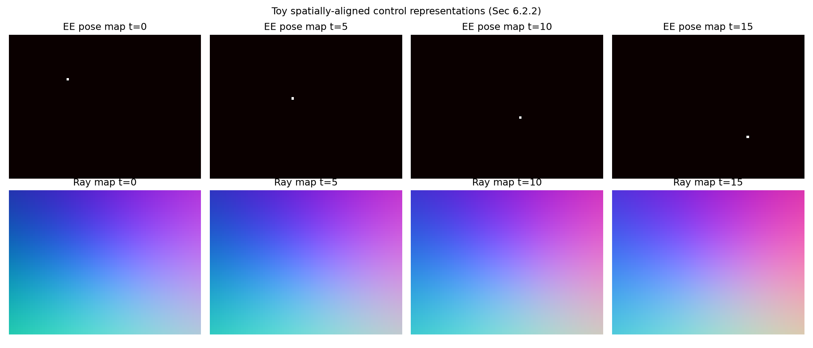

# Control Interface Probe

The paper (Sec 6.2.2) injects actions through a unified pixel-aligned representation:

- **Head camera**: EE pose map (manipulation intent).
- **Wrist cameras**: ray map (camera geometry).

This probe synthesizes toy trajectories and renders the two control modalities.

- EE pose map shape: (16, 60, 80, 2)
- Ray map shape: (16, 60, 80, 3)

