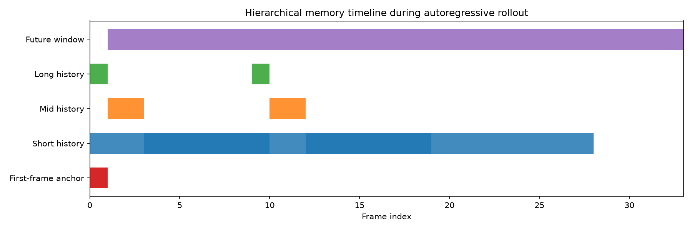
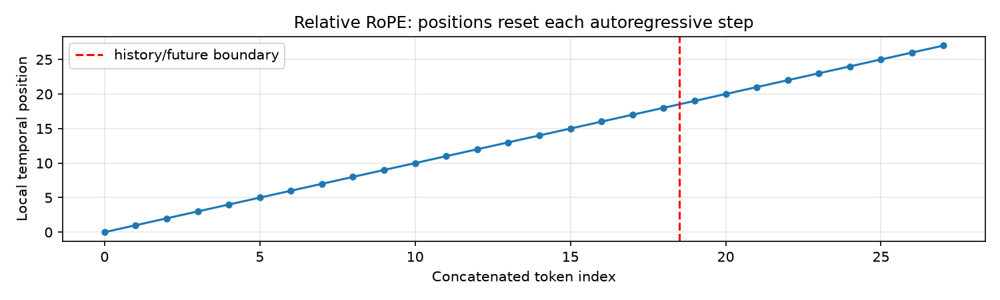

# Hierarchical Memory & Relative RoPE Probe

Config: `/home/alpheratz/Projects/paper-scout/workspace/runs/2026-07-11-gigaworld-vla-corrector-physis/gigaworld-1-2607.02642/code/official_snippets/stage_1_post_functrl_wan21.yaml`

## Token budget estimate

- Total context tokens per denoising step: **8,700**
  - First-frame anchor: 300
  - Short history (16 frames): 4,800
  - Mid history (2 frames): 600
  - Long history (1 frames): 300
  - Future window (9 frames): 2,700

Validation rollout length: 33 frames → 4 chunks of size 9.

## Relative RoPE

At each autoregressive step the concatenated [history, future] sequence gets local positions `0 … history_len+future_len-1`, then RoPE is applied. This prevents the model from seeing unseen absolute positions during long rollouts.

