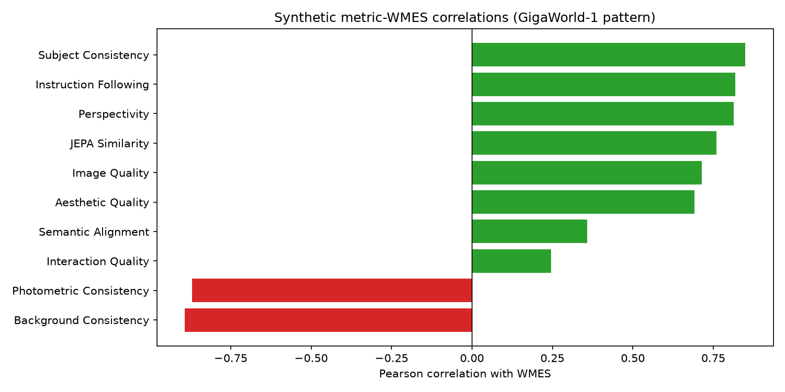
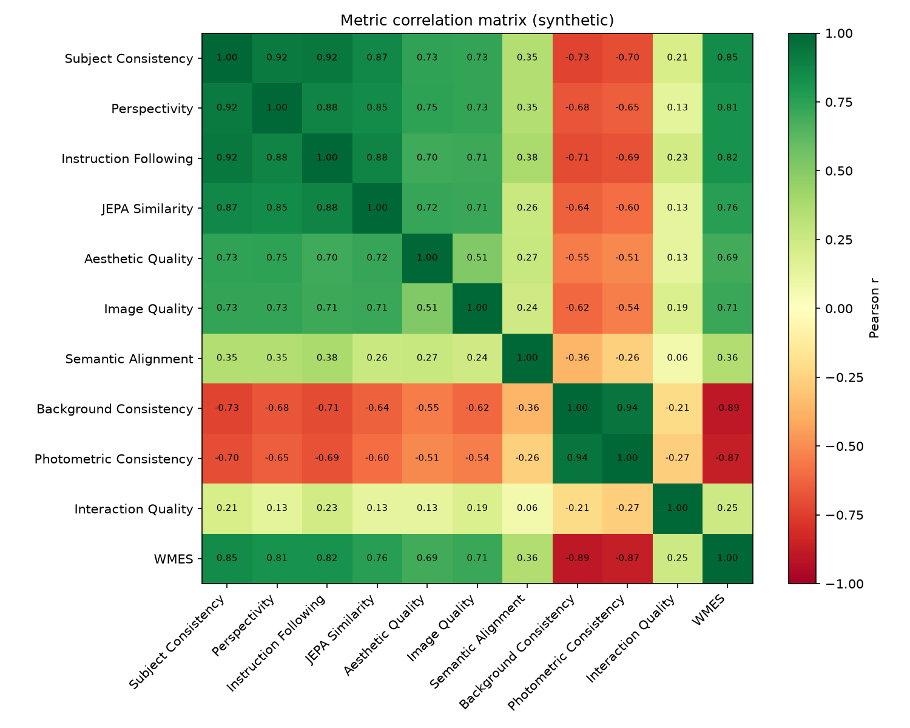

# Synthetic WMBench Metric Correlation Probe

This probe generates synthetic world-model submissions with two latent factors:
1. **evaluator_quality** — drives WMES and honest fidelity/geometry/semantics metrics.
2. **static_bias** — drives appearance-stability metrics independently; high static_bias produces rollouts that look stable but ignore actions, yielding low WMES.

The resulting correlation pattern matches the paper's Finding 1 & 2:

| Metric | Pearson r with WMES |
|---|---|
| Background Consistency | -0.893 |
| Photometric Consistency | -0.870 |
| Interaction Quality | 0.246 |
| Semantic Alignment | 0.359 |
| Aesthetic Quality | 0.691 |
| Image Quality | 0.714 |
| JEPA Similarity | 0.760 |
| Perspectivity | 0.813 |
| Instruction Following | 0.819 |
| Subject Consistency | 0.849 |

