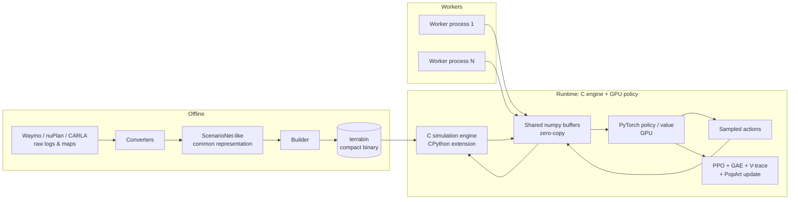

# TerraZero System Architecture

## High-level data flow

## CPU / GPU split

| What | Where | Why |
|------|-------|-----|
| Object-level dynamics, road-edge/off-road tests, collisions, reward computation, traffic-light state machines, observation construction | C engine on CPU | Cheap, branchy simulation work; avoids GPU divergence |
| Policy/value inference, gradients, advantage estimation, PPO update | PyTorch on GPU | Dense tensor math |
| Data exchange | Shared, pinned numpy buffers reinterpreted as fp16/bf16 PyTorch tensors | Zero copy; H2D overlap with kernel launches |
| Orchestration | PufferLib vectorization + Ray/DDP multi-GPU | NUMA-aware worker pinning per rank |

## Throughput claims (measured by authors)

- Single consumer GPU: **560 K agent-steps/sec**
- Single server GPU: **1.30 M agent-steps/sec**
- 8-GPU server node: **2.80 M agent-steps/sec**

## Key performance tricks

1. **Zero-copy path**: C writes directly into buffers the PyTorch training loop reads as tensors.
2. **fp16 observations**: engine emits 16-bit; GPU reinterprets bit-for-bit → halves observation bandwidth.
3. **Variable-size buffers**: sized to controlled agents actually present, not padded to a fixed max count.
4. **NUMA pinning**: each rank's workers pinned to CPU cores local to the GPU's NUMA node.
5. **No rendering**: object-level state only (positions, velocities, road geometry).

## Open questions / not independently verified

- Exact buffer layout and dtype mapping is not published; inferred from paper text.
- "Server GPU" is unspecified (likely A100/H100); authors benchmark on A100 80GB for training.
- Comparison simulators were re-benchmarked by authors under their setup where not otherwise marked.
