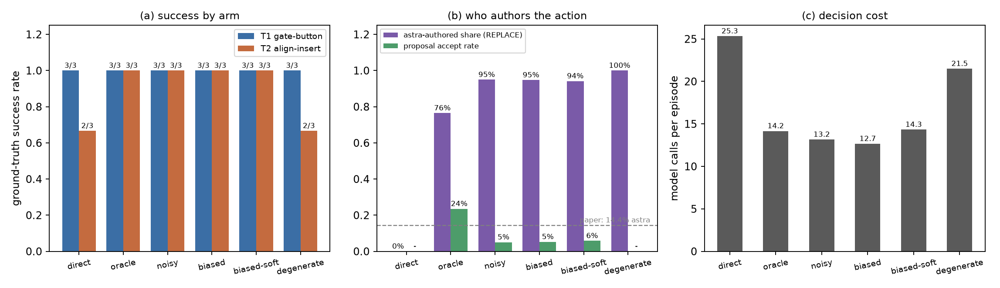
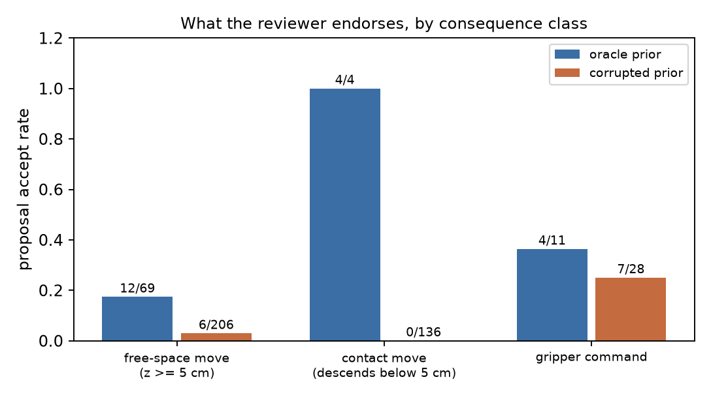

# astra 混合控制 × 小脑先验质量(实验 A)

**问题**:2609.38537 的核心断言是"小脑先验质量决定混合控制的收益正负号"——RoboDojo 上 π0.5 先验好,astra 审查它得到 48%(对 26% 直接控制);RoboLab 上 π0.5 先验差(DROID 零样本 36%),混合反而被拖到 92%,低于直接控制 98%。我们在可控 sim 里复测这条"质量轴",并加测一个自有猜想:是否存在**危险的中间态**——貌似合理但系统性错误的提案(平滑、自信、带恒定几何偏移)比明显垃圾的提案更能锚定审查者。

预登记预测写在 `../assets/PREDICTIONS.md`(实验 A),本文件是结果。

---

## 1. 装置与协议

### 1.1 世界与任务

`code/gpt-policy-sim/`(2026-09-22 建好的 sim harness)把官方 GPT-Policy 的 `run_loop` 接到一个 3D 桌面世界上:点状末端执行器(EE)、俯视与侧视两路相机、硬边界、可恢复的 IK 拒绝、抓取/推拨/碰撞的简化物理。模型就是官方 codex harness 里的 `gpt-6-astra`(每步一次结构化工具调用)。两个任务都自带脚本专家(每任务 24/24 成功),在这次实验里它扮演**小脑**:

| 任务 | 内容 | 为什么入选 |
|---|---|---|
| T1 gate-button | 红方块在透明闸门后,须先按蓝色按钮开门再抓取入绿碗;指令只说"把红方块放进绿碗" | 直接控制本身接近满分(09-22 消融 3/3),混合通道帮不上忙,可测"好先验无害" |
| T2 align-insert | 柱子偏离对齐标记超过 1.5cm 时抓取被物理拒绝,必须先推正;指令只说"把柱子插到盒子里" | 精密、须发现隐藏前提,09-22 消融里直接控制 0/3,是唯一有提升空间的格子 |

### 1.2 混合通道协议

每个决策步,宿主先把小脑的**提案**——一条可直接执行的工具调用 `{"name": ..., "arguments": {...}}`(move_to / move_eef_chunk / set_gripper)——以追加文本块的形式接在该步观测之后:

```
HYBRID CONTROL CHANNEL (decision step k)
Cerebellum proposal (from the low-level policy's own state estimate, not from your images):
{"name":"move_to","arguments":{"target":{"pose_xyzquat":[...]},"note":"..."}}
Answer with exactly one tool call this turn:
- "accept_proposal": the host executes the proposal above exactly as written.
- any other tool: you replace it; the proposal is discarded and never executed.
The proposal is a candidate, not a command, and it can be wrong.
```

astra 每步二选一:`accept_proposal`(宿主逐字执行提案,与该模型自己发出的调用走同一条校验/执行/反馈通路)或任意其它工具(**替换**,提案作废)。协议通过追加系统提示词与工具目录实现,官方仓库 `../gpt-policy` 未改动。每步的判决(提案内容、astra 的选择、模型自己的动作、备注)落在运行包的 `hybrid_step` 事件里,`hybrid_trace.py` 可把一整条 episode 打印成表格。

三点设计说明:提示词在所有臂中逐字相同(只换提案内容本身),不含"当心系统性偏移"之类的暗示;审查是无成本的——替换与接受都算一次决策,模型不因替换而多付预算;"小脑"是读真值状态的脚本专家,不是视觉策略,这里只关心提案内容的对错。

### 1.3 六个臂(5 个预登记 + 1 个探索)

| 臂 | 提案构造 | 有效几何误差 |
|---|---|---|
| `direct` | 无提案(纯 astra 控制,重新跑,不复用 09-22 旧格) | — |
| `hybrid-oracle` | = 专家当前步动作 | 0 |
| `hybrid-noisy` | 专家路点 + 每路点独立 xy 高斯噪声 σ=3cm | ~3cm,逐帧变化 |
| `hybrid-biased` | 固定 SE(2) 误差:p′ = ee + R(15°)·(p − ee) + (5cm, 0),锚在当前 TCP | 短移动 5cm,长移动 5–13cm,全程恒定 |
| `hybrid-biased-soft`(探索臂) | 同上但纯 +2cm x 平移、无旋转 | 恒定 2cm |
| `hybrid-degenerate` | 恒定垃圾 chunk:移到工作区角落 (0.18, 0.18) | 与目标无关 |

`hybrid-biased-soft` 是**预登记之后**加的:冒烟跑(T1 seed 0,每臂 1 格)显示 5cm/15° 的偏移被 astra 逐条识破并拒绝(该格 12/12 替换,备注写明"提案位置不符、提案横移会偏离"),说明这个幅度退化成了"伪装成提案的垃圾",测不到"貌似合理的错误"。软偏置臂把一个刚好超过 T2 的 1.5cm 容差、而在俯视图里只有约 13 像素(≈6.7 像素/cm)的恒定误差单独拿出来,让"幅度"与"可辨识性"两根轴分开。P1–P4 的判定只在预登记的 30 格上做。

判定规则在跑之前定死在 `hybrid_summarize.py` 里:成功率差 ≥3/6 格且双侧 Fisher 精确 p<0.10 才算支持;差 2 格记"弱/不确定";差 ≤1 格算反驳。n=6/臂(2 任务 × 3 种子),所有结论都受这个样本量约束。

---

## 2. 结果

36 格(30 预登记 + 6 探索)全部完成,3 并发,总墙钟 35 分钟。成功率是 sim 的真值判定,不是模型的 `done`。

### 2.1 成功率网格(成功数/n)

| 任务 | direct | oracle | noisy | biased | biased-soft | degenerate |
|---|---|---|---|---|---|---|
| T1 gate-button | 3/3 | 3/3 | 3/3 | 3/3 | 3/3 | 3/3 |
| T2 align-insert | 2/3 | 3/3 | 3/3 | 3/3 | 3/3 | 2/3 |
| **合计** | **5/6** | **6/6** | **6/6** | **6/6** | **6/6** | **5/6** |



成功率几乎顶到天花板:36 格只失败 2 格,且两格分布在 direct 与 degenerate 臂。**没有出现"坏先验把混合系统拖垮"的格子**;T1 全线 3/3,T2 只有直接控制和垃圾提案各失败一次。要理解这张平网格,必须看审查行为本身。

### 2.2 审查行为:谁在写动作

| 臂 | 模型调用(决策步) | astra 自写动作(REPLACE) | astra 介入率 | 接受提案 | 接受率 | 最长连续接受 |
|---|---|---|---|---|---|---|
| direct | 152 | 152 | (构造性 100%) | — | — | — |
| oracle | 85 | 65 | 76.5% | 20 | 23.5% | 7 |
| noisy | 79 | 75 | 94.9% | 4 | 5.1% | 1 |
| biased | 76 | 72 | 94.7% | 4 | 5.3% | 2 |
| biased-soft | 86 | 81 | 94.2% | 5 | 5.8% | 1 |
| degenerate | 129 | 129 | 100% | 0 | 0.0% | 0 |

论文 RoboDojo 上 85.6% 的控制步走 π0.5、只有 14.4% 由 astra 生成或纠正。我们这里连**正确**的提案都只有 23.5% 被接受(oracle 臂),坏提案几乎全被替换。这个差距不是"astra 更强",而是协议结构不同:论文的混合里 π0.5 的 chunk 自主执行一段,astra 在 chunk 边界审查一次;我们强制每个决策步都问一次,所以"接受"是一次主动背书而不是默认继承。**"介入率"这类数字必须连协议一起比,不能单独引用。**

### 2.3 接受率按任务拆分:同一份正确提案,接受率 56% vs 9%

| 臂 | T1 gate-button | T2 align-insert |
|---|---|---|
| oracle | 15/27(56%) | 5/58(9%) |
| noisy | 1/24(4%) | 3/55(5%) |
| biased | 0/24(0%) | 4/52(8%) |
| biased-soft | 0/27(0%) | 5/59(8%) |
| degenerate | 0/24(0%) | 0/105(0%) |

这是本轮最反直觉的一个数字。给出**完全正确**的提案时,T1 上 astra 沿用了 56%,T2 上只有 9%——两份提案的对错没有区别,区别在于**它和 astra 自己计划的合拍程度**。T1 的专家流程(按按钮 → 开门 → 抓 → 放)与 astra 的直觉方案一致;T2 的专家要求"先用闭爪把柱子推到标记再抓",而 astra 反复尝试先直接抓(抓取失败的反馈只告诉它"夹爪空闭、扭矩 0.25",不告诉它"柱子偏离标记超过容差"),于是它在 T2 上几乎全程按自己的方案走。换言之,审查者接受的不是"提案质量"这个抽象量,而是"提案是否与我的计划一致,或者至少无害"。

### 2.4 接受发生在哪一类动作上

把提案按后果分类:**自由空间移动**(所有路点 z ≥ 5cm,不可能接触任何物体)、**接触移动**(有路点降到 5cm 以下)、**夹爪指令**。

| 结果类 | oracle | noisy | biased | biased-soft | degenerate |
|---|---|---|---|---|---|
| 自由空间移动 | 12/69(17%) | 2/67(3%) | 1/65(2%) | 3/74(4%) | 0/0 |
| 接触移动 | 4/4(100%) | 0/2(0%) | 0/2(0%) | 0/3(0%) | 0/129(0%) |
| 夹爪指令 | 4/11(36%) | 2/10(20%) | 3/9(33%) | 2/9(22%) | 0/0 |



这张表把机制说清楚了。三种几何损坏(噪声、硬偏置、软偏置)都只污染**路点坐标**,不碰夹爪指令;于是:被污染的几何提案在坏先验臂里接受率掉到 2–4%,而**没被污染的夹爪指令在坏先验臂里仍被接受 20–33%**,与 oracle 臂的 36% 相差不远。也就是说,astra 是逐条命令按图像核对的,不是按"这是哪个臂/这个先验可不可信"整体判断的。degenerate 臂 129 次接触型垃圾提案 0 次被接受,而它在 T1 上仍然 3/3——垃圾提案被完全无视,这正是 P2 预测的形态。

### 2.5 成本

| 臂 | 平均决策数 | 平均 token(单格) | token/决策 | 平均 check_path |
|---|---|---|---|---|
| direct | 25.3 | 889,984 | 35,131 | 2.3 |
| oracle | 14.2 | 446,042 | 31,485 | 0.8 |
| noisy | 13.2 | 409,322 | 31,088 | 0.8 |
| biased | 12.7 | 390,144 | 30,801 | 0.8 |
| biased-soft | 14.3 | 449,724 | 31,376 | 0.8 |
| degenerate | 21.5 | 836,266 | 38,896 | 0.7 |

成本差异几乎全部来自 **episode 长度**,不来自单步开销:每步输入固定在 ~31k token(其中 80–84% 是缓存命中,与论文 RoboDojo 报告"cached input 主导"的观察一致),提案文本那 150 token 淹没在噪声里。所以在我们这套"每步都问"的协议下,混合控制既不省 token 也不省调用——能不能省,取决于小脑能不能替模型跑掉中间的决策步,而这一点在论文自己的工作里也有反例(RoboCasa 混合比直接控制记录到更多模型请求)。

---

## 3. 逐条预测判定

### P1 hybrid-oracle ≥ direct,且 astra 决策数显著更少 —— **支持(弱)**

成功率 6/6 vs 5/6(Fisher p=1.0,不显著,因为都顶在天花板上)。真正的证据在 T2:direct 用了 18 / 42 / 56 步,第三格以 `give_up` 收场;oracle 用 22 / 16 / 20 步全部成功。astra 自写动作 65 次(oracle)对 152 次(direct),模型调用 85 对 152。两个子句方向都对,但 n=6、且是被天花板压平的成功率,只能算方向性支持。

### P2 hybrid-degenerate ≈ direct —— **支持**

5/6 vs 5/6(差 0 格)。机制上更干净:degenerate 臂 129 次提案**一次都没被接受**,接受率 0%,模型的每一次动作都是自己写的,成功率自然回到 direct 水平。这不是"astra 学会了忍耐",而是"astra 一眼都不看"。

### P3(**自有猜想**)hybrid-biased < direct —— **反驳**

6/6 vs 5/6,biased 不低于 direct;并且 biased(6/6)也不低于 degenerate(5/6),"中间态比两端都危险"的说法没有出现。更致命的是锚定机制的直接观测:在全部坏先验臂里,**最长连续接受 ≤ 2**(oracle 格子里能到 7);被接受的少数提案集中在高空悬停与夹爪指令上;每一次"接受了错误提案"的下一步都跟着一次纠正。硬偏置的 76 次提案被拒 72 次,软偏置的 86 次被拒 81 次。锚定签名(持续接受同一条系统性错误、越陷越深)在本设置里根本没有出现。

原因不是"偏置太小":软偏置的 2cm 已经超过 T2 的 1.5cm 对齐容差,接受它就会真的把柱子推不到位(冒烟格外的数据也显示 3cm 噪声同样被逐条识别)。原因是审查姿态:**当审查者每步都被问一次、能看图、且替换零成本时,它默认自己重新推导动作,提案只在一个它无法独立验证的子空间(自由空间悬停)里被沿用。** 先验质量的"正负号"因此被压缩成"少量低后果动作的损耗",不足以改变成功率。

### P4 接受率随提案质量下降,但 biased 臂接受率顽固偏高 —— **部分支持 + 锚定子句不支持**

池化接受率:oracle 23.5% > noisy 5.1% > biased 5.3% > biased-soft 5.8% > degenerate 0%。粗粒度上成立(正确 ≫ 损坏 ≈ 垃圾),细粒度上没有:noisy 5.1% 与 biased 5.3% 谁高谁低只差 4 个接受事件,在 2 个百分点容差内算顺序成立,但**没有**"带系统性偏置的提案比随机噪声更容易被接受"这回事。锚定子句要求 biased 显著高于 degenerate,实测差距 +5.3pp,对照预登记的 15pp 门槛未达标。

### 附带:astra 介入率对照论文

我们的 REPLACE 占比 76.5%(oracle)到 100%(degenerate),远高于论文的 14.4%。差异见 2.2 节的协议解释:论文统计的是"控制步里由 π0.5 执行的比例"(一次审查覆盖一整个 chunk),我们统计的是"每个决策步的归属"。两个数字不可直接比较,但方向明确:在这套逐决策审查的协议下,astra 是主笔,小脑是参考。

---

## 4. 失败归因:两格,同一个机制,与提案通道无关

| 格子 | 结局 | 迹象 |
|---|---|---|
| T2 direct seed 2 | 56 步后 `give_up` | 56 次决策里 35 次 `set_gripper`;世界事件窗口(仅保留最近 40 条)的最后 16 条全是 `grasp_failed`;末尾自述"夹爪空闭、扭矩 0.25,柱体仍在桌面" |
| T2 degenerate seed 2 | 60 步预算耗尽 | 60 次决策里 39 次 `set_gripper`、7 次 `move_eef_chunk`、14 次 `move_to`;世界事件窗口里 20 条 `grasp_failed`;**0 次接受提案** |

两格死在同一件事上:T2 的隐藏前提是"柱子必须先在标记 1.5cm 以内,抓取才被允许",而抓取失败时模型能看到的反馈只有"夹爪闭合到底、扭矩 0.25"(即"什么都没夹到"),看不到 `world_events` 里记着的拒绝原因 `plug_off_alignment_mark`——这是仿真刻意的信息隔离(真机也不会告诉你隐藏前提)。于是模型把连续空夹归因成"高度/姿态不对",换高度、换侧向姿态、换开度,在 35–39 次闭爪里耗尽预算或主动放弃。这与混合通道无关:direct 臂没有提案也照样死;degenerate 格的失败发生在它一次都没接受提案的情况下。把这两格记为**真失败(任务难度)**,不是协议故障。

顺带一个值得报告的对照:同样的 T2 + none 配置,2026-09-22 的消融是 0/3(其中 2 格是首步幻觉 `done`),今天是 2/3 且没有一例首步幻觉。**模型行为在两周内变了**,跨日期比较 gpt-6-astra 的格子级数字要谨慎。

---

## 5. 代表 trace

完整逐步表见文末附录(每个 episode 的权威数据源是对应 run 目录的 `events.jsonl`)。

**(a) 好先验被真正沿用**:`runs/T1_hybrid-oracle_s0_20261007-173510_success`(11 步,9 接受 / 2 替换)。astra 从第 0 步起连接受 7 条提案(接近按钮 → 下压 → 抬升 → 移到方块 → 下降 → 闭爪 → 三路点搬运),只在第 7 步改成"再往碗底下一点再松爪"、第 10 步自己宣布 `done`。这是本实验里 "hybrid 就是 astra 监督小脑执行" 的教科书形态,也是唯一接受率稳定的形态(该格 82%)。

**(b) 锚定的最近一例(仍不是锚定)**:`runs/T2_hybrid-biased_s1_20261007-174813_success`。第 2 步接受未被污染的闭爪指令;第 3 步接受了被 +5cm 偏置过的悬停点 `(0.640, 0.505, 0.10)`——真正的接近点应是 `(0.590, 0.500, 0.10)` 附近,**这一个错误提案真的被执行了**。但第 4 步 astra 立刻发现"柱子未随夹爪抬起",改写动作接管,最终 0.001m 精度插入成功。这格完整展示了"错误提案被接受"的真实后果:高空悬停错 5cm 不改变任何物理状态,所以**危害为零**;真正致命的接触动作从不被接受。

**(c) 失败长什么样**:`runs/T2_direct_s2_20261007-175146_failed`,见上节。

---

## 6. 与论文的关系,以及这次实验证不了什么

**复测到的**:论文"混合控制需要小脑先验至少不自相矛盾"的方向在我们的设置里以**成本**的形式复现(oracle 平均 14.2 步 / 446k token,degenerate 21.5 步 / 836k token,垃圾提案让审查者多花 50% 决策),但没有复现成 RoboDojo 的成功率增益,也没有复现 RoboLab 的"坏先验拖垮混合"。两支都没复现的原因是同一个:**论文的混合把决策权按 chunk 分给小脑,我们的混合每步都问一次。** 结构不同,先验质量能造成的差异被压小了。

**没测到的**:论文的 14.4%/85.6% 是"π0.5 自主执行 vs astra 介入"的步数占比,我们测的是"每个决策点的动作归属"。要严格复测,需要让小脑一次决策自主执行一段(接受时冻结若干决策步不问模型),这需要改动官方 `run_loop` 的循环结构,超出本次范围。

**证伪的**:本实验对"危险中间态"给出的答案是**否定**——至少在"审查者每步都在场、可看图、替换零成本"的条件下,系统性错误没有被误当作可信轨迹,反而和随机噪声一样被逐条识别。这并不意味着中间态不存在:它更可能出现在**审查频率低、审查者不与执行器共享观测、或替换有代价**的混合架构里,那才是这套协议测不到的盲区,也是下一步该做的对照。

**其余局限**:n=3 种子/格,成功率天花板效应明显,成功率类结论的检定力很低;T2 的难度使 2/6 direct 格进入抓取重试循环,给不出干净的成功率基线;小脑是脚本专家而非学习策略,它的"提案风格"(单步路点、与 astra 计划不同步)本身就会压低接受率;token 账本由 codex 的 usage 事件得到(本次为历史首次接入),per-call 明细在 `usage.jsonl`。

---

## 7. 产物

本目录 `code/` 收录脚本与权威记录的子集(平铺);36 个完整运行包、日志与冒烟记录体积大,留在实验台 `code/gpt-policy-sim/`(workspace 级,不入库)。

| 路径 | 内容 |
|---|---|
| `code/hybrid_agent.py` | 混合通道:提案生成(4 种损坏 + 软偏置)、`accept_proposal` 工具、协议注入、`hybrid_step` 事件、mock 审查者 |
| `code/run_episode.py` | 新增 `--arm`,按臂增强工具目录与提示词;新增 token 账本接入 |
| `code/hybrid_ablate.py` | 36 格驱动(3 并发、断点续跑、单格 2100s 超时),日志在实验台 `results/hybrid_logs/` |
| `code/hybrid_summarize.py` | 汇总与判定:本文件所有数字的来源,输出 `results/hybrid_summary.md` 与两张图 |
| `code/hybrid_trace.py` | 单 episode 步表打印器 |
| `code/hybrid_cells.jsonl` | 36 格权威记录(成功、决策数、接受/替换、token) |
| `code/hybrid_summary.md` | 机器生成的完整数字表(本文件是其叙事版) |
| `../assets/hybrid_grid.png`、`../assets/hybrid_deference.png` | 本文件的两张图 |

仅在实验台(不入库):`code/gpt-policy-sim/results/hybrid_cells_enriched.json`(逐格派生指标:接受序列、后果分类、失败签名)、`code/gpt-policy-sim/runs/<T>_<arm>_s<seed>_*`(36 个完整运行包:events.jsonl、frames、usage.json、transcript)、`code/gpt-policy-sim/runs_smoke/`(5 格真实 codex 冒烟 + 首次通过的 1 次 direct)。

---

## 8. 附录:三条代表 trace 的逐步表

由实验台 `code/gpt-policy-sim/hybrid_trace.py <run_dir> --notes` 生成(同脚本已收进本目录 `code/`)。每条 trace 的权威数据源是该 run 目录下的 `events.jsonl`(其中 `hybrid_step` 事件记录每步的提案、astra 的选择、模型动作与备注);下面引用的 `runs/` 路径相对实验台 `code/gpt-policy-sim/`。

## 1. hybrid-oracle 成功,提案被高比例沿用(T1 gate-button, seed 0,11 步,9 accept / 2 replace)

```
# T1_hybrid-oracle_s0_20261007-173510_success
success=True detail=cube_in_bowl=True dist_xy=0.000 cube_z=0.025 grasped=None
step            stage   choice  proposal        waypoint                   model           waypoint
   0  approach-button   accept  move_to         (0.331,0.741,0.080)        accept_proposal -
   1     press-button   accept  move_to         (0.331,0.741,0.026)        accept_proposal -
   2 verify-gate-open   accept  move_to         (0.331,0.741,0.120)        accept_proposal -
   3    approach-cube   accept  move_to         (0.664,0.477,0.180)        accept_proposal -
   4     descend-cube   accept  move_to         (0.664,0.477,0.026)        accept_proposal -
   5       grasp-cube   accept  set_gripper     gripper=0.0                accept_proposal -
   6    carry-to-bowl   accept  move_eef_chunk  (0.664,0.477,0.220)->(0.254,0.252,0.100) x3 accept_proposal -
   7     release-cube  replace  set_gripper     gripper=1.0                move_to         (0.254,0.252,0.026)
     note: 方块仍悬在碗上方，暂不松爪；沿碗中心下降至底部支撑位置。
   8     release-cube   accept  set_gripper     gripper=1.0                accept_proposal -
   9          retract   accept  move_to         (0.254,0.252,0.200)        accept_proposal -
  10             done  replace  done            -                          done            -
     note: 红方块位于绿碗内，侧视图显示其由碗底支撑。夹爪张开并升至0.20米后，方块仍留在碗中，确认已脱离夹爪，无明显未解决问题。
terminal: done at step 10 :: {"summary": "红方块位于绿碗内，侧视图显示其由碗底支撑。夹爪张开并升至0.20米后，方块仍留在碗中，确认已脱离夹爪，无明显未解决问题。", "hindsight": "先按按钮开门；搬运后下降至碗底支撑再释放，并抬升验证方块未随动。"}
```

权威数据源:`runs/T1_hybrid-oracle_s0_20261007-173510_success/events.jsonl`

## 2. 锚定「未发生」的最近一例:astra 接受了系统性错位的提案,下一步立即纠正(T2 align-insert, biased 臂, seed 1)

```
# T2_hybrid-biased_s1_20261007-174813_success
success=True detail=plug_in_box=True dist_xy=0.001 plug_z=0.013 grasped=None
step            stage   choice  proposal        waypoint                   model           waypoint
   0    close-gripper  replace  set_gripper     gripper=0.0                check_path      (0.570,0.500,0.150)->(0.570,0.500,0.012) x2
     note: 柱子位于导轨上，夹爪尚未对准。先检查接近路径及隐藏障碍。
   1    close-gripper  replace  set_gripper     gripper=0.0                move_eef_chunk  (0.570,0.500,0.150)->(0.570,0.500,0.012) x2
     note: 接近路径检查未发现障碍。保持张开夹爪，对准柱子后观察。
   2    close-gripper   accept  set_gripper     gripper=0.0                accept_proposal -
   3    approach-plug   accept  move_to         (0.640,0.505,0.100)        accept_proposal -
   4    approach-plug  replace  move_to         (0.657,0.491,0.100)        move_to         (0.610,0.500,0.012)
     note: 柱子仍在导轨上，未随夹爪抬起。移到柱子外侧低位，准备向红色标记推齐。
   5    approach-plug  replace  move_to         (0.655,0.499,0.100)        move_to         (0.500,0.500,0.012)
     note: 夹爪已在柱子外侧稳定。沿导轨推向红色标记，观察柱子响应。
   6    approach-plug  replace  move_to         (0.547,0.499,0.100)        move_eef_chunk  (0.500,0.500,0.080)->(0.450,0.500,0.012) x3
     note: 柱子已越过标记少许，仍受导轨约束。抬起绕到另一侧，准备小幅推回。
   7    approach-plug  replace  move_to         (0.545,0.512,0.100)        move_to         (0.478,0.500,0.012)
     note: 夹爪已稳定在柱子内侧。小幅向外推，使柱子中心回到红色标记。
   8    approach-plug  replace  move_to         (0.571,0.512,0.100)        set_gripper     gripper=1
```

权威数据源:`runs/T2_hybrid-biased_s1_20261007-174813_success/events.jsonl`

## 3. 失败 trace:与提案通道无关的抓取重试循环(T2 direct, seed 2,give_up)

```
# T2_direct_s2_20261007-175146_failed
success=False detail=plug_in_box=False dist_xy=0.332 plug_z=0.008 grasped=None
step            stage   choice  proposal        waypoint                   model           waypoint
terminal: give_up at step 55 :: {"reason": "未能建立可靠夹持，无法安全搬运并插入。已尝试红标及橙色柱体位置、多种高度、上下及侧向姿态、不同开度；闭合始终无夹持阻力，最新反馈开度为零、扭矩仅0.25，柱体仍在桌面，盒子插孔仍空。现有观察无法确定有效抓取条件，继续盲试或强行搬运缺乏安全依据。", "hindsight": "应在连续空夹后尽早重新核实抓取条件，避免反复猜测高度和姿态；位置到达不代表夹持成立。本次未完成插入
```

权威数据源:`runs/T2_direct_s2_20261007-175146_failed/events.jsonl`(direct 臂无 hybrid_step;世界事件窗口的最后 16 条全是 `grasp_failed`,56 次决策里 35 次是 set_gripper;详见 README 失败归因)
